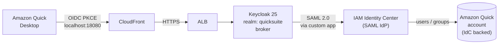
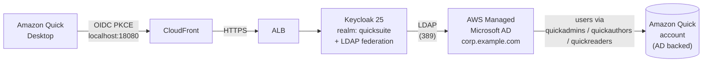

# QuickSuite Desktop SSO via Keycloak — Two Identity Backends

[中文版](README.zh.md) | English

CloudFormation deployment of a **Keycloak 25** Identity Provider that federates **Amazon Quick Desktop** (OIDC + PKCE) to either **AWS IAM Identity Center** or **AWS Managed Microsoft AD**, depending on a single `SCENARIO` flag.

End-to-end tested on `us-east-1` with Quick Enterprise edition.

## Architecture

Both scenarios share the same Keycloak / Aurora / ALB / CloudFront infrastructure. Only the identity backend differs.

### Scenario 1 — IAM Identity Center backed (`SCENARIO=idc`)



### Scenario 2 — Active Directory backed (`SCENARIO=ad`)



In both cases the Desktop client receives an OIDC `id_token` whose `email` claim matches an existing Quick user, completing the sign-in.

## What Gets Deployed

| Resource | Description |
|----------|-------------|
| **AWS Managed Microsoft AD** | Cross-AZ directory in private subnets. Required for `SCENARIO=ad`; optional for `SCENARIO=idc`. |
| **ECS Fargate (Keycloak 25)** | 2 vCPU / 4 GB task running `quay.io/keycloak/keycloak:25.0`, Infinispan cache, ECS Exec enabled. |
| **Aurora Serverless v2 PostgreSQL 16** | Multi-AZ, capacity range 0.5 – 4 ACU, encrypted, snapshot on delete. |
| **Internet-facing ALB** | HTTPS-only, ACM cert, Security Group ingress restricted to the CloudFront origin-facing managed prefix list (no `0.0.0.0/0`). |
| **CloudFront distribution** | `PriceClass_All`, `CachingDisabled`, `AllViewer` origin policy — required because OIDC tokens / JWKS must not be cached. |
| **Route 53 alias records** | Public alias to CloudFront + internal alias for the origin (used as SNI). |
| **Service discovery** | Cloud Map private namespace for Keycloak Infinispan JGroups DNS_PING. |
| **Secrets Manager** | Three secrets: AD admin password, Keycloak admin credentials, Aurora master credentials. |
| **CloudWatch Logs** | `/ecs/keycloak`, 30-day retention, ECS Container Insights enabled. |

## Prerequisites

### Local toolchain

| Tool | Minimum | Where it is used |
|------|---------|------------------|
| `bash` | 3.2+ (default on macOS / Linux) | All scripts (`#!/usr/bin/env bash` shebang) |
| `python3` | 3.8+ | Inline JSON parsing inside scripts (uses f-strings) |
| `aws` (AWS CLI v2) | 2.15+ | Required for `ds-data` and recent `sso-admin` subcommands |
| `curl` | any modern build | Keycloak Admin REST and OIDC discovery calls |
| `git` | any | Cloning the repo |
| **Session Manager plugin** | latest | Required by `aws ecs execute-command`, used by `verify-ldap.sh` and `inspect-ad.sh` |

Install the Session Manager plugin:

```bash
# macOS (Homebrew)
brew install --cask session-manager-plugin

# Ubuntu / Debian
curl -L "https://s3.amazonaws.com/session-manager-downloads/plugin/latest/ubuntu_64bit/session-manager-plugin.deb" \
  -o /tmp/session-manager-plugin.deb
sudo dpkg -i /tmp/session-manager-plugin.deb

# Verify
session-manager-plugin --version
```

`sed`, `awk`, `grep`, `tr`, `base64`, `find` are part of standard coreutils and are present on macOS and any modern Linux. Windows users should run from **WSL2** (Ubuntu) or a Linux VM — native CMD / PowerShell are not supported because of the bash shebang.

### AWS account & IAM permissions

The deployment provisions resources across many services. The simplest route for a one-off install is a principal with `AdministratorAccess`. For tighter environments, the operator role needs at minimum:

| Service | Why |
|---------|-----|
| **CloudFormation** | `cloudformation:*` to deploy the three stacks |
| **IAM** | Create / pass roles for ECS task / RDS / Directory Service |
| **EC2 / VPC** | Manage security groups and the optional DHCP options for Managed AD |
| **ECS** | Cluster, task definition, service, **`ecs:ExecuteCommand`** |
| **RDS** | Aurora cluster + instances + snapshots |
| **Directory Service + Directory Service Data** | Create / read AD; Scenario 2 also needs `ds:EnableDirectoryDataAccess` and `ds-data:*` |
| **Secrets Manager** | Three secrets (AD admin, Keycloak admin, Aurora master) |
| **Route 53** | `ChangeResourceRecordSets` on the public hosted zone |
| **ACM** | `DescribeCertificate` only (the cert itself is pre-existing) |
| **CloudFront** | Manage one distribution |
| **Service Discovery (Cloud Map)** | Private namespace for Keycloak Infinispan |
| **CloudWatch Logs** | `/ecs/keycloak` log group + Container Insights |
| **STS / Organizations** | `GetCallerIdentity`, `DescribeOrganization` (pre-flight) |
| **IAM Identity Center** | `sso-admin:*`, `identitystore:*` (Scenario 1 only) |
| **Amazon Quick (QuickSight)** | `quicksight:DescribeAccountSubscription` (pre-flight) and console-level admin (subscribing, Extension Access) |

### Service quota

The CloudFront origin-facing managed prefix list reference counts ~45 entries against a security group's inbound-rule limit. Default is 60, leaving no headroom — raise the quota first.

```
Service: VPC
Quota:   L-0EA8095F  (Inbound or outbound rules per security group)
Request: 200
```

Approval is usually 1–3 business days.

### Networking

| Resource | Requirement |
|----------|-------------|
| VPC | Existing, with a NAT Gateway so private subnets can reach the public internet for image pulls |
| Private subnets | ≥ 2, in different AZs (Aurora needs a cross-AZ subnet group) |
| Public subnets | ≥ 2, in different AZs (ALB cross-AZ requirement) |
| ECS task subnet | A private subnet whose AZ is also covered by one of the public subnets, otherwise ALB targets are marked `unused` |

### Domain & ACM certificate

- Route 53 public hosted zone for your domain.
- Two hostnames inside the zone:
  - `KEYCLOAK_DOMAIN` — public entry point, e.g. `keycloak.example.com`
  - `ORIGIN_ALIAS_NAME` — internal SNI alias used by CloudFront → ALB, e.g. `kc-origin.example.com`
- ACM certificate **in `us-east-1`** that covers both names. The simplest approach is a wildcard `*.example.com`.

### Amazon Quick subscription

Quick Enterprise edition with home region `us-east-1` is required. The identity choice you make at signup can be wrong — the deployment lets you switch it (Scenario 2) by unsubscribing and re-subscribing.

## Quick Deploy

### 1. Configure environment

```bash
git clone https://github.com/dzkd2007/keycloaks-Quick-Desktop-SSO.git
cd keycloaks-Quick-Desktop-SSO
cp .env.example .env
chmod 600 .env
$EDITOR .env   # see DEPLOYMENT.md §3 for every variable
```

Pick your scenario by setting `SCENARIO=idc` or `SCENARIO=ad` in `.env`.

### 2. Provision infrastructure

```bash
./deploy-infra.sh
```

Runs three CloudFormation stacks in sequence (Managed AD ≈ 30 min on first create; Keycloak ≈ 10 min; CloudFront ≈ 5–10 min) and updates Route 53 to point your Keycloak domain at CloudFront.

### 3. Bootstrap the Keycloak realm

Open `https://<KEYCLOAK_DOMAIN>/admin`, sign in as the Keycloak admin, and create realm `quicksuite`. See [03-keycloak-realm-config.md](03-keycloak-realm-config.md) for the full settings (and for `SCENARIO=ad`, the LDAP federation).

### 4. Configure the identity backend (scenario-specific)

| Scenario | What to do | Document |
|----------|------------|----------|
| `idc` | Create a Customer Managed SAML 2.0 application in IAM Identity Center, download metadata as `idc-saml-metadata.xml`, assign users. | [04a-identity-center-setup.md](04a-identity-center-setup.md) |
| `ad`  | Run `./ad-setup-quick.sh` to create test groups/users in Managed AD, then unsubscribe and re-subscribe Amazon Quick with **Active Directory** as the identity type, binding the new groups to roles. | [04b-ad-quick-setup.md](04b-ad-quick-setup.md) |

### 5. Wire up Keycloak

```bash
./configure-keycloak.sh
./verify-oidc.sh
```

`configure-keycloak.sh` is idempotent. It branches on `SCENARIO`: it creates the SAML Identity Provider for `idc`, disables it for `ad`, and in both cases creates the OIDC public client `amazon-quick-desktop` (PKCE S256, redirect URI `http://localhost:18080`).

`verify-oidc.sh` should report `OK — Keycloak side looks good.`

### 6. Register the Extension Access in the Amazon Quick console

Add an Extension Access of type **Desktop application for Quick** with the OIDC endpoints emitted by `verify-oidc.sh`. See [05-quick-extension-access.md](05-quick-extension-access.md).

### 7. Test

Install Amazon Quick Desktop, click **Enterprise login**, and complete the flow. See [DEPLOYMENT.md §9](DEPLOYMENT.md#9-phase-6装-quick-desktop-端到端验证) for what to expect at each redirect.

## Parameters

`.env` is the single source of truth; every script and CFN command reads from it.

| Variable | Required for | Description |
|----------|-------------|-------------|
| `SCENARIO` | both | `idc` or `ad` — selects identity backend. |
| `AWS_REGION`, `AWS_ACCOUNT_ID` | both | Must be `us-east-1`. |
| `VPC_ID`, `PRIVATE_SUBNET_1`, `PRIVATE_SUBNET_2`, `PUBLIC_SUBNET_1`, `PUBLIC_SUBNET_2`, `ECS_SUBNET` | both | Network layout. ECS subnet must share an AZ with at least one ALB public subnet. |
| `ROUTE53_HOSTED_ZONE_ID`, `KEYCLOAK_DOMAIN`, `ORIGIN_ALIAS_NAME`, `CERTIFICATE_ARN` | both | Public domain, internal SNI alias, ACM cert (in `us-east-1`). |
| `KEYCLOAK_ADMIN_USER`, `KEYCLOAK_ADMIN_PASSWORD` | both | Keycloak master admin. |
| `DB_MASTER_USERNAME`, `DB_MASTER_PASSWORD` | both | Aurora master credentials. |
| `AD_DOMAIN_NAME`, `AD_SHORT_NAME`, `AD_ADMIN_PASSWORD`, `AD_EDITION` | scenario `ad` (required); scenario `idc` (only if you also want LDAP federation) | Managed AD parameters. |
| `IDC_INSTANCE_ARN`, `IDC_IDENTITY_STORE_ID`, `IDC_SAML_METADATA_FILE` | scenario `idc` | Identity Center coordinates and the metadata file you downloaded in Step 4a. |
| `AD_TEST_USER_SAM`, `AD_TEST_USER_EMAIL`, `AD_TEST_USER_PASSWORD` | scenario `ad` | Used by `ad-setup-quick.sh`. |
| `KEYCLOAK_REALM`, `KEYCLOAK_OIDC_CLIENT_ID`, `KEYCLOAK_IDP_ALIAS` | both | Defaults are sensible (`quicksuite`, `amazon-quick-desktop`, `iam-identity-center`). |

## Security Notes

- The ALB Security Group **must not** allow `0.0.0.0/0`. Ingress is restricted to `pl-3b927c52` (CloudFront origin-facing managed prefix list); CloudFront re-validates the host via SNI against the ACM cert.
- The Keycloak admin console is reachable only through CloudFront; restrict console access at the application layer (admin password rotation, IP-based admin policy, or a separate WAF rule).
- The OIDC client is **public** with PKCE S256 — there is no client secret to leak. Any tampering with the redirect URI breaks the flow.
- Aurora is encrypted at rest, has a 7-day automated backup retention, and uses `DeletionPolicy: Snapshot`.
- All credentials live only in `.env` and Secrets Manager. `.env` is `.gitignore`-d.
- The Quick subscription identity choice **cannot** be changed after creation; switching scenarios on an existing Quick account requires unsubscribing first.

## Deployment Timeline

The orchestrator (`deploy-infra.sh`) takes approximately **45–60 minutes** end to end on a clean account:

1. Pre-flight checks (CLI / region / ACM / Route 53)
2. CFN: Managed AD ≈ 30 min on first create
3. CFN: Keycloak ECS + Aurora + ALB ≈ 10 min
4. CFN: CloudFront ≈ 5–10 min
5. Route 53 alias update + healthcheck wait

Manual phases (realm, identity backend, Quick console) add roughly another 30–45 minutes.

## Cost Estimate

Monthly estimate for `us-east-1`, On-Demand, single-task / low-traffic SSO. Pricing pulled from the AWS Pricing API.

### Shared infrastructure

| Component | Calculation | Monthly |
|-----------|-------------|--------:|
| ECS Fargate (2 vCPU + 4 GB, 24/7) | $0.04048/vCPU-hr × 2 + $0.004445/GB-hr × 4, × 730 hr | **$72.08** |
| Application Load Balancer (≈ 1 LCU) | $0.0225/hr × 730 + $0.008 × 730 | **$22.27** |
| Aurora Serverless v2 (avg 0.7 ACU + 5 GB storage) | $0.12/ACU-hr × 0.7 × 730 + $0.10/GB-month | **$61.82** |
| CloudFront (PriceClass_All, < 10 GB egress) | $0.085/GB + $0.0075/10K req | ~$1.00 |
| Route 53 (1 hosted zone) | $0.50/zone-month + queries | ~$0.60 |
| Secrets Manager (3 secrets) | $0.40/secret-month | $1.20 |
| CloudWatch Logs (≈ 2 GB ingest+store) | $0.50/GB ingest + $0.03/GB-month | ~$1.00 |
| NAT Gateway (1 reused from existing VPC) | $0.045/hr × 730 | $32.85 |
| ACM, IAM Identity Center | — | $0 |
| **Shared total** | | **≈ $192.82** |

### Scenario 1 — IdC backed

| | Monthly |
|---|--------:|
| Shared total | $192.82 |
| Managed AD (optional, recommend skipping for this scenario) | $0 (skip) or +$87.60 (Standard, kept for future use) |
| **Scenario 1 total** | **≈ $192.82** (or ≈ $280.42 if AD is kept) |

### Scenario 2 — AD backed

| | Monthly |
|---|--------:|
| Shared total | $192.82 |
| AWS Managed Microsoft AD **Standard** (2 DCs × $0.06/hr × 730) | **+$87.60** |
| **Scenario 2 total (Standard)** | **≈ $280.42** |
| Scenario 2 total (Enterprise, > 5,000 users) | ≈ $484.82 |

The net delta between scenarios is the Managed AD bill (~$88/month for Standard; ~$292/month for Enterprise). All other components are identical.

> Estimates assume single-task, low traffic, average 0.7 ACU. Real production workloads should re-estimate by measured LCU, ACU usage, egress, and Logs ingestion. Aurora can scale to 4 ACU on bursts (~$350/month equivalent at full capacity).

## Cleanup

Manual UI steps first, then CFN stacks in reverse order:

```bash
# 1. Quick console: delete the Extension and Extension Access
# 2. Scenario 1: IdC console → Applications → Customer managed → delete the SAML application
#    Scenario 2: optionally clean up AD test users / groups via aws ds-data delete-*
# 3. Route 53: delete the Keycloak A-alias record
# 4. CFN stacks (reverse order)
aws cloudformation delete-stack --stack-name quicksuite-keycloak-cf --region us-east-1
aws cloudformation wait stack-delete-complete --stack-name quicksuite-keycloak-cf --region us-east-1

aws cloudformation delete-stack --stack-name quicksuite-keycloak --region us-east-1
aws cloudformation wait stack-delete-complete --stack-name quicksuite-keycloak --region us-east-1
# Aurora has DeletionPolicy: Snapshot — a final snapshot is retained.

aws cloudformation delete-stack --stack-name quicksuite-managed-ad --region us-east-1
aws cloudformation wait stack-delete-complete --stack-name quicksuite-managed-ad --region us-east-1
```

The ACM certificate, Route 53 hosted zone, VPC, NAT Gateway, and Quick subscription are not created by this template and are left untouched.

## Repository Layout

| File | Purpose |
|------|---------|
| `DEPLOYMENT.md` | Full step-by-step walkthrough — start here on first deploy. |
| `.env.example` | Environment variable template. |
| `01-managed-ad.yaml` | CFN: AWS Managed Microsoft AD. |
| `02-keycloak-infra.yaml` | CFN: Keycloak ECS + Aurora + ALB. |
| `02b-cloudfront.yaml` | CFN: CloudFront fronting the ALB. |
| `03-keycloak-realm-config.md` | Manual Admin UI steps for both scenarios. |
| `04a-identity-center-setup.md` | Scenario 1 — IdC SAML application. |
| `04b-ad-quick-setup.md` | Scenario 2 — AD users/groups + Quick AD-backed re-subscription. |
| `05-quick-extension-access.md` | Manual: register the OIDC endpoints in the Quick console. |
| `deploy-infra.sh` | Orchestrates the three CFN deploys + Route 53 + healthcheck. |
| `configure-keycloak.sh` | Idempotent realm wiring (SAML IdP for `idc`, OIDC client always). |
| `ad-setup-quick.sh` | Scenario 2 — creates AD groups + test user via the Directory Service Data API. |
| `verify-oidc.sh` | OIDC discovery + JWKS + client + IdP sanity checks. |
| `verify-ldap.sh` | LDAP reachability + bind from inside the ECS task. |
| `inspect-keycloak.sh` | Read-only Keycloak realm/IdP/client snapshot. |
| `inspect-keycloak-ldap.sh` | Scenario 2 — LDAP federation mappers + user sync verification. |
| `inspect-ad.sh` | Scenario 2 — current AD users and groups. |
| `test-keycloak-ldap-login.sh` | Scenario 2 — full OIDC password grant against AD. |
| `disable-saml-idp.sh` | Toggles off the SAML IdP when switching `idc` → `ad`. |

## License

[MIT](LICENSE)
