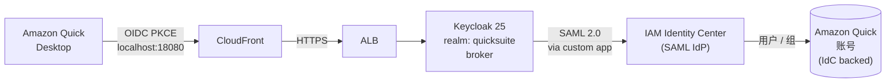
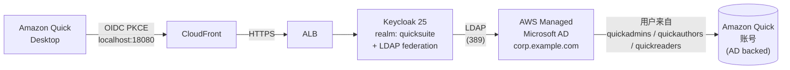

# 通过 Keycloak 实现 QuickSuite Desktop SSO（双身份后端）

中文 | [English](README.md)

CloudFormation 部署的 **Keycloak 25** 身份提供商，把 **Amazon Quick Desktop**（OIDC + PKCE）联合到 **AWS IAM Identity Center** 或 **AWS Managed Microsoft AD**，由一个 `SCENARIO` 开关切换。

`us-east-1` + Quick Enterprise edition 实测可用。

## 架构

两个场景共用同一套 Keycloak / Aurora / ALB / CloudFront 基础设施，只在身份后端上分叉。

### 场景 1 — IAM Identity Center 后端（`SCENARIO=idc`）



### 场景 2 — Active Directory 后端（`SCENARIO=ad`）



两个场景里 Desktop 客户端都会拿到一个 OIDC `id_token`，其中 `email` claim 必须匹配 Quick 账号已有用户的 email，登录才能通过。

## 部署的资源

| 资源 | 说明 |
|------|------|
| **AWS Managed Microsoft AD** | 跨 AZ，私有子网。`SCENARIO=ad` 必需；`SCENARIO=idc` 可选。 |
| **ECS Fargate（Keycloak 25）** | 2 vCPU / 4 GB 任务，镜像 `quay.io/keycloak/keycloak:25.0`，Infinispan 缓存，已开启 ECS Exec。 |
| **Aurora Serverless v2 PostgreSQL 16** | 多 AZ，0.5–4 ACU，加密，删除时打 snapshot。 |
| **公网 ALB** | 仅 HTTPS，挂 ACM 证书，Security Group 入站只放 CloudFront 托管 prefix list（无 `0.0.0.0/0`）。 |
| **CloudFront 分发** | `PriceClass_All`、`CachingDisabled`、`AllViewer` —— 因为 OIDC token / JWKS 不能被边缘缓存。 |
| **Route 53 alias 记录** | 公网 alias 到 CloudFront + 内部 alias 给回源 SNI 用。 |
| **服务发现** | Cloud Map 私有 namespace，给 Keycloak Infinispan JGroups DNS_PING 用。 |
| **Secrets Manager** | 3 个 secret：AD admin 密码、Keycloak admin、Aurora master。 |
| **CloudWatch Logs** | `/ecs/keycloak`，30 天保留，Container Insights 已开。 |

## 前提条件

- AWS 账号在 `us-east-1`（CloudFront ACM 与 Quick Desktop 仅支持 us-east-1）
- 已有 VPC，公有/私有子网各跨 ≥ 2 个 AZ，并且有 NAT Gateway
- 已有 Route 53 公网 hosted zone
- 已有 **us-east-1** 的 ACM 证书，覆盖 Keycloak 公网域名 + 一个内部源站 alias（最简单做一张通配 `*.example.com`）
- 服务配额 `VPC L-0EA8095F`（每 SG 入站规则数）≥ **200** —— CloudFront origin-facing prefix list 单条引用就 ~45 条 entry，默认 60 不够
- 已有 Amazon Quick (Suite) Enterprise 订阅
- 场景 2：账号必须是 AWS Organizations master 或 delegated admin

## 快速部署

### 1. 配置环境变量

```bash
git clone https://github.com/dzkd2007/keycloaks-Quick-Desktop-SSO.git
cd keycloaks-Quick-Desktop-SSO
cp .env.example .env
chmod 600 .env
$EDITOR .env   # 每个变量的取值方式见 DEPLOYMENT.md §3
```

在 `.env` 里设 `SCENARIO=idc` 或 `SCENARIO=ad` 选择场景。

### 2. 部署基础设施

```bash
./deploy-infra.sh
```

按顺序跑 3 个 CFN stack（首次创建 Managed AD ≈ 30 分钟，Keycloak ≈ 10 分钟，CloudFront ≈ 5–10 分钟），并把 Route 53 的 Keycloak 域名指向 CloudFront。

### 3. 初始化 Keycloak realm

打开 `https://<KEYCLOAK_DOMAIN>/admin`，用 Keycloak admin 登录，创建 realm `quicksuite`。详细 settings（含 `SCENARIO=ad` 的 LDAP federation）见 [03-keycloak-realm-config.md](03-keycloak-realm-config.md)。

### 4. 配置身份后端（按场景）

| 场景 | 操作 | 文档 |
|------|------|------|
| `idc` | 在 IAM Identity Center 创建 Customer Managed SAML 2.0 application，下载 metadata 存为 `idc-saml-metadata.xml`，分配用户。 | [04a-identity-center-setup.md](04a-identity-center-setup.md) |
| `ad` | 跑 `./ad-setup-quick.sh` 在 Managed AD 里建测试组/用户，然后取消 Quick 订阅、改用 **Active Directory** identity 重新订阅，并把新建的 group 绑给对应角色。 | [04b-ad-quick-setup.md](04b-ad-quick-setup.md) |

### 5. 配置 Keycloak

```bash
./configure-keycloak.sh
./verify-oidc.sh
```

`configure-keycloak.sh` 幂等，按 `SCENARIO` 分支：`idc` 创建 SAML Identity Provider，`ad` 禁用它；两个场景都创建 OIDC public client `amazon-quick-desktop`（PKCE S256，redirect URI 写死 `http://localhost:18080`）。

`verify-oidc.sh` 应该输出 `OK — Keycloak side looks good.`。

### 6. 在 Amazon Quick 控制台注册 Extension Access

按 [05-quick-extension-access.md](05-quick-extension-access.md) 添加 **Desktop application for Quick** 的 Extension Access，OIDC 端点直接抄 `verify-oidc.sh` 输出的值。

### 7. 端到端测试

装 Amazon Quick Desktop，点 **Enterprise login**，走完登录流程。每一跳应该看到的内容见 [DEPLOYMENT.md §9](DEPLOYMENT.md#9-phase-6装-quick-desktop-端到端验证)。

## 参数

`.env` 是唯一真相源，所有脚本和 CFN 命令都从它读。

| 变量 | 必填条件 | 说明 |
|------|---------|------|
| `SCENARIO` | 两场景 | `idc` 或 `ad`，选身份后端。 |
| `AWS_REGION`, `AWS_ACCOUNT_ID` | 两场景 | 必须 `us-east-1`。 |
| `VPC_ID`, `PRIVATE_SUBNET_1`, `PRIVATE_SUBNET_2`, `PUBLIC_SUBNET_1`, `PUBLIC_SUBNET_2`, `ECS_SUBNET` | 两场景 | 网络。ECS 子网必须和某个 ALB 公有子网在同一 AZ。 |
| `ROUTE53_HOSTED_ZONE_ID`, `KEYCLOAK_DOMAIN`, `ORIGIN_ALIAS_NAME`, `CERTIFICATE_ARN` | 两场景 | 公网域名、内部 SNI alias、ACM 证书（须在 `us-east-1`）。 |
| `KEYCLOAK_ADMIN_USER`, `KEYCLOAK_ADMIN_PASSWORD` | 两场景 | Keycloak master admin。 |
| `DB_MASTER_USERNAME`, `DB_MASTER_PASSWORD` | 两场景 | Aurora master 凭据。 |
| `AD_DOMAIN_NAME`, `AD_SHORT_NAME`, `AD_ADMIN_PASSWORD`, `AD_EDITION` | 场景 `ad` 必填；场景 `idc` 仅当也想保留 LDAP 时填 | Managed AD 参数。 |
| `IDC_INSTANCE_ARN`, `IDC_IDENTITY_STORE_ID`, `IDC_SAML_METADATA_FILE` | 场景 `idc` | IdC 坐标 + Step 4a 下载下来的 metadata 文件。 |
| `AD_TEST_USER_SAM`, `AD_TEST_USER_EMAIL`, `AD_TEST_USER_PASSWORD` | 场景 `ad` | `ad-setup-quick.sh` 用。 |
| `KEYCLOAK_REALM`, `KEYCLOAK_OIDC_CLIENT_ID`, `KEYCLOAK_IDP_ALIAS` | 两场景 | 默认值即可（`quicksuite`、`amazon-quick-desktop`、`iam-identity-center`）。 |

## 安全说明

- ALB Security Group **不允许** `0.0.0.0/0` 入站。仅放行 `pl-3b927c52`（CloudFront 托管 prefix list）；CloudFront 通过 SNI 与 ACM 证书匹配做二次校验。
- Keycloak admin 控制台只能通过 CloudFront 访问。生产环境建议在应用层加固（轮换 admin 密码、按 IP 限制 admin 操作、单独的 WAF 规则等）。
- OIDC client 是 **public** + PKCE S256，没有 client secret 可泄漏。redirect URI 改一下整个流程就断。
- Aurora 静态加密、保留 7 天自动备份、`DeletionPolicy: Snapshot`。
- 所有凭据都只在 `.env` 和 Secrets Manager 里。`.env` 已加进 `.gitignore`。
- Quick 订阅的 identity 选择**不可修改**。在已有 Quick 账号上切换场景必须先 unsubscribe 再 subscribe。

## 部署时间

`deploy-infra.sh` 整体 **45–60 分钟** 跑完干净账号：

1. Pre-flight 检查（CLI / region / ACM / Route 53）
2. CFN: Managed AD ≈ 30 分钟（首次）
3. CFN: Keycloak ECS + Aurora + ALB ≈ 10 分钟
4. CFN: CloudFront ≈ 5–10 分钟
5. Route 53 更新 + 健康轮询

手动那 3 步（realm、身份后端、Quick 控制台）再加 30–45 分钟。

## 费用估算

`us-east-1` 月度估算，On-Demand，单 task / 低流量 SSO。价格来自 AWS Pricing API。

### 共用基础设施

| 组件 | 计算 | 月费 |
|------|------|----:|
| ECS Fargate（2 vCPU + 4 GB，24/7） | $0.04048/vCPU-hr × 2 + $0.004445/GB-hr × 4，× 730 hr | **$72.08** |
| Application Load Balancer（≈ 1 LCU） | $0.0225/hr × 730 + $0.008 × 730 | **$22.27** |
| Aurora Serverless v2（平均 0.7 ACU + 5 GB 存储） | $0.12/ACU-hr × 0.7 × 730 + $0.10/GB-月 | **$61.82** |
| CloudFront（PriceClass_All，< 10 GB egress） | $0.085/GB + $0.0075/万次 | ~$1.00 |
| Route 53（1 个 hosted zone） | $0.50/zone-月 + 查询 | ~$0.60 |
| Secrets Manager（3 个 secret） | $0.40/secret-月 | $1.20 |
| CloudWatch Logs（≈ 2 GB ingest+store） | $0.50/GB ingest + $0.03/GB-月 | ~$1.00 |
| NAT Gateway（复用 VPC 现有 1 个） | $0.045/hr × 730 | $32.85 |
| ACM、IAM Identity Center | — | $0 |
| **共用合计** | | **≈ $192.82** |

### 场景 1 — IdC 后端

| | 月费 |
|---|----:|
| 共用合计 | $192.82 |
| Managed AD（可选；本场景推荐不部署） | $0（不部署）或 +$87.60（保留给将来用） |
| **场景 1 合计** | **≈ $192.82**（保留 AD 时 ≈ $280.42） |

### 场景 2 — AD 后端

| | 月费 |
|---|----:|
| 共用合计 | $192.82 |
| AWS Managed Microsoft AD **Standard**（2 DC × $0.06/hr × 730） | **+$87.60** |
| **场景 2 合计（Standard）** | **≈ $280.42** |
| 场景 2 合计（Enterprise，> 5,000 用户） | ≈ $484.82 |

两场景净差额就是 Managed AD（Standard 约 $88/月，Enterprise 约 $292/月）。其它组件完全一样。

> 估算前提：单 task、低流量、平均 0.7 ACU。生产环境请按实测 LCU、ACU、egress、Logs ingest 重估。Aurora 在峰值会到 4 ACU（满负荷折算约 $350/月）。

## 清理资源

先在控制台手工删，再倒序删 CFN：

```bash
# 1. Quick 控制台：删 Extension 和 Extension Access
# 2. 场景 1：IdC 控制台 → Applications → Customer managed → 删 SAML application
#    场景 2：可选清理 AD 测试用户/组：aws ds-data delete-*
# 3. Route 53：删 Keycloak 域名的 A-alias 记录
# 4. CFN stacks（倒序）
aws cloudformation delete-stack --stack-name quicksuite-keycloak-cf --region us-east-1
aws cloudformation wait stack-delete-complete --stack-name quicksuite-keycloak-cf --region us-east-1

aws cloudformation delete-stack --stack-name quicksuite-keycloak --region us-east-1
aws cloudformation wait stack-delete-complete --stack-name quicksuite-keycloak --region us-east-1
# Aurora 是 DeletionPolicy: Snapshot，会留 final snapshot

aws cloudformation delete-stack --stack-name quicksuite-managed-ad --region us-east-1
aws cloudformation wait stack-delete-complete --stack-name quicksuite-managed-ad --region us-east-1
```

ACM 证书、Route 53 hosted zone、VPC、NAT Gateway、Quick 订阅本来就不是模板创建的，本步骤不动。

## 仓库结构

| 文件 | 用途 |
|------|------|
| `DEPLOYMENT.md` | 完整部署手册 —— 第一次部署先看这个。 |
| `.env.example` | 环境变量模板。 |
| `01-managed-ad.yaml` | CFN：AWS Managed Microsoft AD。 |
| `02-keycloak-infra.yaml` | CFN：Keycloak ECS + Aurora + ALB。 |
| `02b-cloudfront.yaml` | CFN：CloudFront 前置 ALB。 |
| `03-keycloak-realm-config.md` | 两场景共用的 Admin UI 手动步骤。 |
| `04a-identity-center-setup.md` | 场景 1 —— IdC SAML application。 |
| `04b-ad-quick-setup.md` | 场景 2 —— AD 用户/组 + Quick 重订阅 AD-backed。 |
| `05-quick-extension-access.md` | 在 Quick 控制台注册 OIDC 端点。 |
| `deploy-infra.sh` | 串联 3 个 CFN + Route 53 + 健康检查。 |
| `configure-keycloak.sh` | 幂等的 Keycloak realm 配置（场景 1 建 SAML IdP，两场景都建 OIDC client）。 |
| `ad-setup-quick.sh` | 场景 2 —— 用 Directory Service Data API 建 AD 组和测试用户。 |
| `verify-oidc.sh` | OIDC discovery、JWKS、client、IdP 配置自检。 |
| `verify-ldap.sh` | 在 ECS 容器内验证 LDAP 网络与 bind。 |
| `inspect-keycloak.sh` | 只读：当前 Keycloak realm/IdP/client 快照。 |
| `inspect-keycloak-ldap.sh` | 场景 2 ——LDAP federation mappers + 用户同步状态。 |
| `inspect-ad.sh` | 场景 2 —— 当前 AD 用户和组。 |
| `test-keycloak-ldap-login.sh` | 场景 2 —— 用 AD 用户跑完整 OIDC password grant 自检。 |
| `disable-saml-idp.sh` | 工具：场景间切换时禁用 SAML IdP。 |

## License

[MIT](LICENSE)
